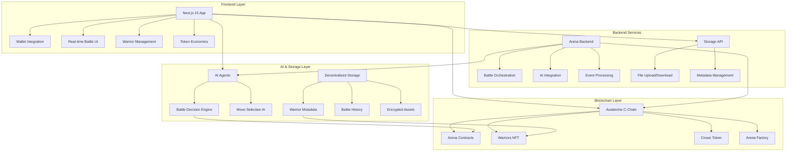
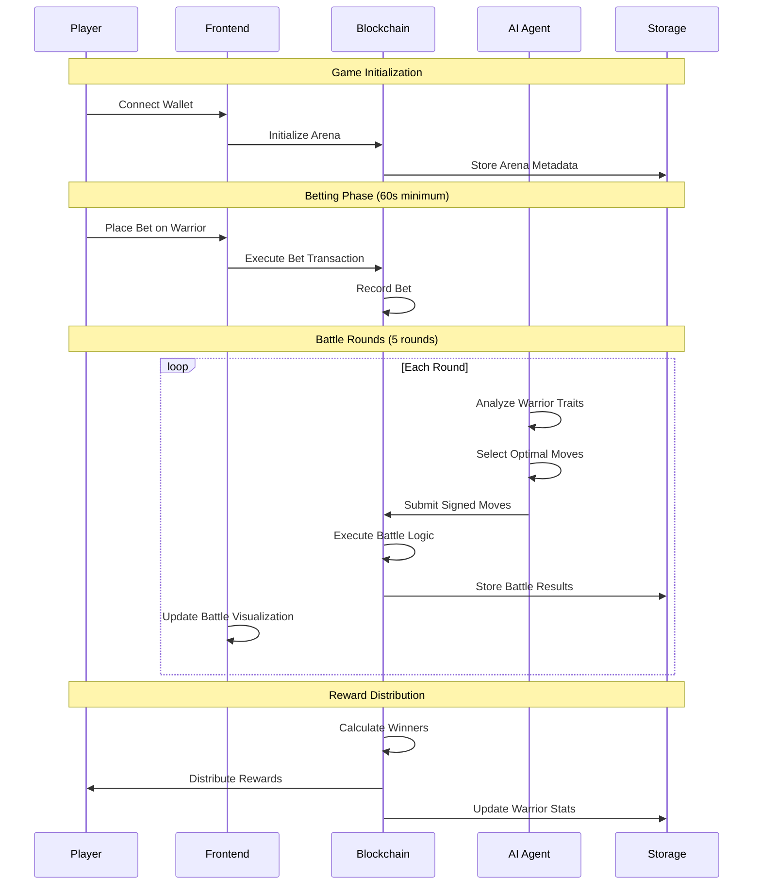
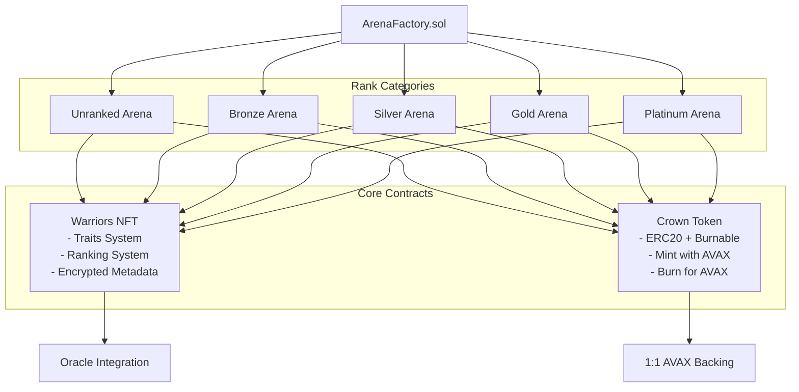
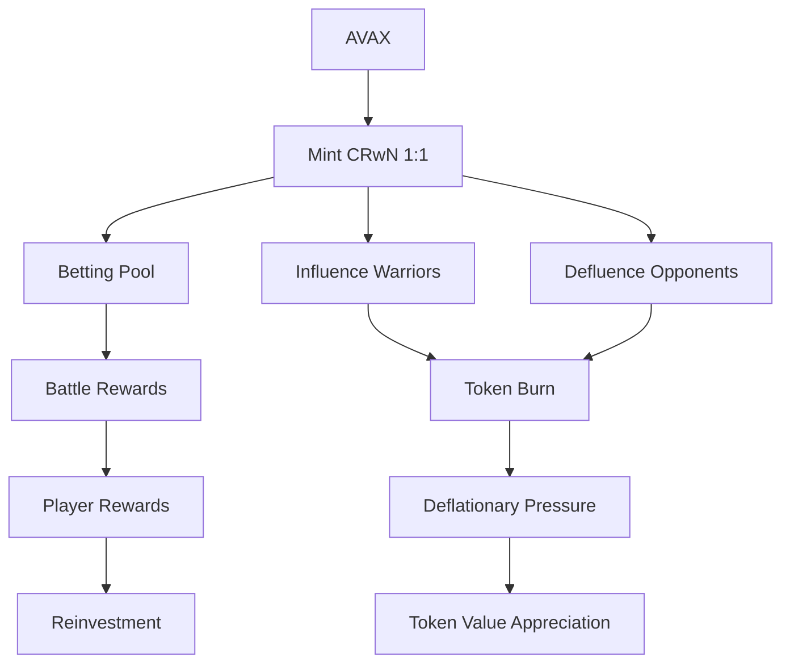

# WarriorsAI-rena: AI-Powered Blockchain Battle Arena

> **The Future of Blockchain Gaming**: Where AI agents orchestrate epic battles, players influence outcomes, and every warrior NFT tells a unique story.

## Project Overview

**WarriorsAI-rena** is a blockchain-based battle arena game that combines:
- **AI-Powered Combat**: Real AI agents make strategic decisions during battles
- **Player Agency**: Bet, influence, and directly impact battle outcomes
- **True Ownership**: Warriors as dynamic NFTs with evolving traits and abilities
- **Sustainable Economics**: Crown Token (CRwN) with 1:1 AVAX backing
- **Avalanche C-Chain**: Fast, low-cost transactions on Avalanche

## System Architecture

### High-Level Architecture Diagram



### Technical Stack

| Component | Technology | Purpose |
|-----------|------------|---------|
| **Blockchain** | Avalanche C-Chain | Smart contracts and token economics |
| **Frontend** | Next.js 15 + TypeScript | Modern web interface |
| **AI Layer** | AI Agents | Battle decision making |
| **Storage** | Decentralized Storage | Metadata and battle history |
| **Smart Contracts** | Solidity + Foundry | Battle logic and tokenomics |
| **Wallet Integration** | RainbowKit + Wagmi | Multi-wallet support |
| **Backend** | Node.js + Express | API services and orchestration |

## Game Flow Architecture

### Battle Lifecycle Diagram



### Smart Contract Architecture



## Smart Contract Details

### Core Contracts

#### 1. Arena.sol - Battle Engine
```solidity
// Key Features:
- 5-round battle system with AI-controlled moves
- Betting mechanics with fixed amounts per rank
- Influence/Defluence system for strategic gameplay
- Cryptographic verification of AI decisions
- Automatic reward distribution

// Battle Moves:
enum PlayerMoves {
    STRIKE,   // Strength-based attack
    TAUNT,    // Charisma + Wit combination
    DODGE,    // Defense-focused evasion
    SPECIAL,  // Personality + Strength ultimate
    RECOVER   // Defense + Charisma healing
}
```

#### 2. WarriorsNFT.sol - Character System
```solidity
// Warrior Traits (0-100 with 2 decimal precision):
struct Traits {
    uint16 strength;   // Physical power
    uint16 wit;        // Intelligence and strategy
    uint16 charisma;   // Social influence
    uint16 defence;    // Damage resistance
    uint16 luck;       // Random factor influence
}

// Ranking System:
enum Ranking {
    UNRANKED, BRONZE, SILVER, GOLD, PLATINUM
}
```

#### 3. CrownToken.sol - Economic Engine
```solidity
// Unique Features:
- 1:1 AVAX backing (mint 1 CRwN with 1 AVAX)
- Burn CRwN to receive AVAX back
- Utility in betting, influence, and governance
- Deflationary mechanics through gameplay
```

### Contract Addresses (Avalanche Fuji Testnet)

> **Note**: Deploy contracts using `DeployAvalancheSimplified.s.sol` and update addresses below.

| Contract | Address | Purpose |
|----------|---------|---------|
| MockOracle | *Deploy and update* | Random number generation |
| CrownToken | *Deploy and update* | Game currency and governance |
| WarriorsNFT | *Deploy and update* | Warrior character NFTs |
| ArenaFactory | *Deploy and update* | Arena creation and management |

## Getting Started

### Prerequisites

- Node.js 18+ and npm
- Git
- Foundry (for smart contract development)
- Wallet with AVAX (Fuji Testnet: https://faucet.avax.network/)

### Installation & Setup

1. **Clone the Repository**
```bash
git clone https://github.com/your-username/WarriorsAI-rena.git
cd WarriorsAI-rena
```

2. **Install Smart Contract Dependencies**
```bash
forge install
```

3. **Frontend Setup**
```bash
cd frontend
npm install
```

4. **Backend Setup** (if arena-backend exists)
```bash
cd arena-backend
npm install
```

### Environment Configuration

Create `.env.local` in the frontend directory:
```bash
# Avalanche Configuration
NEXT_PUBLIC_CHAIN_ID=43113
NEXT_PUBLIC_AVALANCHE_TESTNET_RPC=https://api.avax-test.network/ext/bc/C/rpc
NEXT_PUBLIC_GAME_MASTER_PRIVATE_KEY=your_private_key_here

# Storage Configuration
NEXT_PUBLIC_STORAGE_API_URL=http://localhost:3001

# Pinata IPFS Configuration
PINATA_JWT=your_pinata_jwt_here
NEXT_PUBLIC_GATEWAY_URL=your_gateway_url_here
```

### Running the Project

#### Option 1: Full Development Setup
```bash
# Terminal 1: Frontend
cd frontend
npm run dev

# Terminal 2: Arena Backend (if available)
cd arena-backend
npm start
```

#### Option 2: Frontend Only
```bash
cd frontend
npm run dev
```

The application will be available at `http://localhost:3000`

## Key Features

### 1. AI-Powered Battle System
- **Real AI Agents**: AI agents make strategic decisions during battles
- **Dynamic Combat**: No two battles are ever the same
- **Cryptographic Verification**: All AI decisions are signed and verified on-chain
- **Strategic Depth**: 5 different move types with complex interaction mechanics

### 2. Player Agency Mechanics
- **Strategic Betting**: Bet on warriors with analysis of traits and history
- **Influence System**: Boost warrior performance using Crown tokens
- **Defluence Mechanics**: Strategically weaken opponents (limited use)
- **Real-time Participation**: Watch battles unfold with live updates

### 3. Advanced NFT System
- **Dynamic Traits**: Warriors have 5 core attributes affecting battle performance
- **Ranking Progression**: Warriors advance through rank tiers via victories
- **Custom Moves**: Each warrior has personalized attack names

### 4. Sustainable Economics
- **Crown Token (CRwN)**: 1:1 AVAX backing prevents death spirals
- **Utility-Driven**: Tokens consumed in gameplay, not just traded
- **Deflationary Mechanics**: Influence/defluence burns tokens
- **Revenue Mechanism**: 5% of betting pools fund can be charged for the ecosystem development in the future.

## Security Features

### Smart Contract Security
- **Reentrancy Guards**: Protection against reentrancy attacks
- **Signature Verification**: ECDSA signatures for AI decisions
- **Time Locks**: Betting periods and battle intervals prevent manipulation
- **Access Control**: Owner-only functions protected with OpenZeppelin Ownable

### Economic Security
- **Defluence Limits**: One defluence per player per game
- **Oracle Integration**: Verifiable random number generation
- **Transparent History**: All battles permanently recorded on-chain

## Avalanche Integration

### Why Avalanche?
- **Fast Finality**: Sub-second transaction confirmation
- **Low Fees**: Minimal gas costs for battle transactions
- **EVM Compatible**: Full Ethereum tooling support
- **SnowTrace**: Block explorer at https://testnet.snowtrace.io

### Network Configuration
| Network | Chain ID | RPC URL | Explorer |
|---------|----------|---------|----------|
| Fuji Testnet | 43113 | `https://api.avax-test.network/ext/bc/C/rpc` | https://testnet.snowtrace.io |
| C-Chain Mainnet | 43114 | `https://api.avax.network/ext/bc/C/rpc` | https://snowtrace.io |

## Game Economics

### Token Utility Flow


### Reward Distribution
- **Winners**: 95% of betting pool (minus gas)
- **Protocol**: 5% for development and maintenance (in future)
- **Warrior Owners**: Rank-based rewards

## Development

### Smart Contract Development
```bash
# Compile contracts
forge build

# Run tests
forge test

# Deploy to Avalanche Fuji
forge script script/DeployAvalancheSimplified.s.sol --rpc-url https://api.avax-test.network/ext/bc/C/rpc --broadcast -vvvv
```

### Frontend Development
```bash
# Development server (in frontend folder)
npm run dev

# Build for production
npm run build
```

## License

This project is licensed under the MIT License - see the [LICENSE](LICENSE) file for details.

## Acknowledgments

- **Avalanche**: For providing fast, low-cost EVM-compatible infrastructure
- **Foundry**: For the excellent smart contract development framework
- **Next.js Team**: For the amazing React framework
- **OpenZeppelin**: For secure smart contract libraries

---

**Built with care by the Seeers Team**

*Where AI meets blockchain, and every battle tells a story.*
