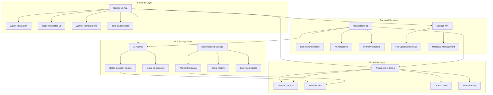
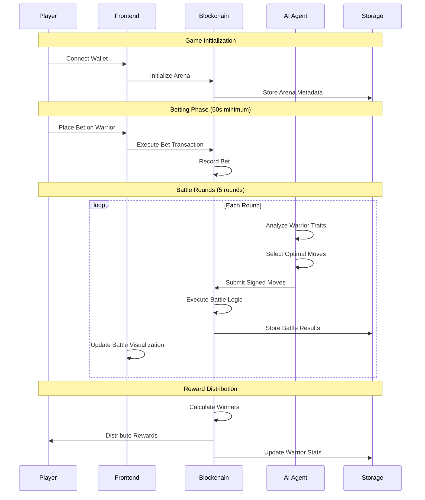
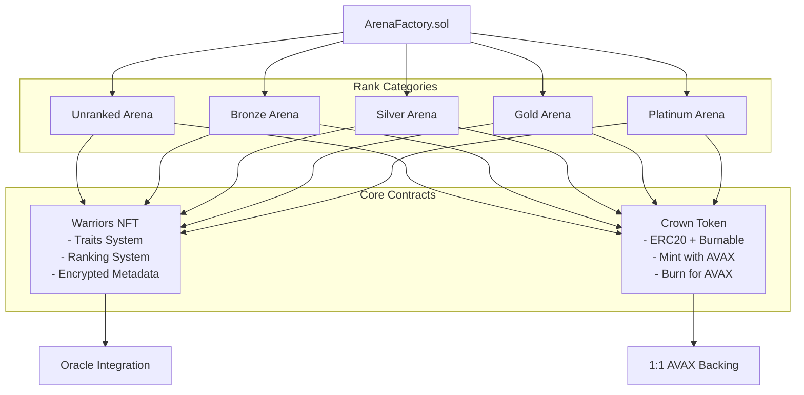
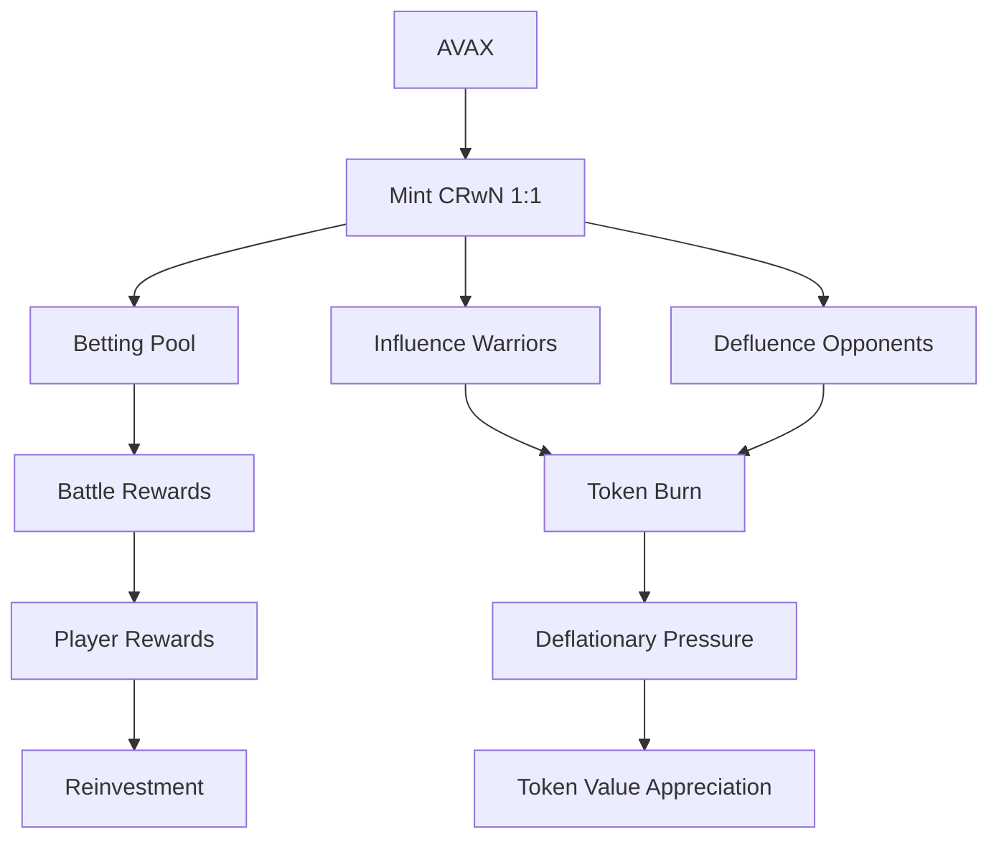

# WarriorsAI-rena

**AI-powered NFT battle arena on Avalanche C-Chain** | [Live Demo](https://warriors-ai-rena.vercel.app/)

> Built for [Avalanche AVAX Build Games Hackathon](https://www.avax.network/) | Fuji Testnet (Chain ID 43113) | Mainnet-ready (Chain ID 43114)

## 📚 Documentation Index

| Document | Audience | What's Inside |
|----------|----------|---------------|
| **[WHITEPAPER.md](WHITEPAPER.md)** | Technical readers, builders | System architecture, tokenomics math, game theory of the influence mechanic, STRIDE threat model, governance design, references |
| **[PITCH-DECK.md](PITCH-DECK.md)** | Investors, partners | 15-slide deck with problem/solution/Why Now, product, traction, business model, roadmap, team, ask |
| **[BUSINESS-PLAN.md](BUSINESS-PLAN.md)** | Investors, due-diligence | Market sizing, personas, competitive "why they can't copy us", worked battle example, Bear/Base/Bull P&L, cap table, comparable exit multiples |
| **[FUTURE-PLAN.md](FUTURE-PLAN.md)** | Team, investors | 4-phase roadmap, assumptions log with invalidation tripwires, quantitative phase gates, resource-to-milestone mapping |
| **[DEPLOYMENT.md](DEPLOYMENT.md)** | Developers, operators | Testnet & mainnet deployment instructions, pre-flight checklist, rollback procedures, troubleshooting |
| **[HACKATHON-SUBMISSION.md](HACKATHON-SUBMISSION.md)** | Hackathon judges | Concise feature + architecture summary |

## Core Features

### 1. Warrior NFT Minting
Mint unique warrior NFTs with AI-generated personalities and traits. Each warrior gets 5 core stats (Strength, Wit, Charisma, Defence, Luck) and 5 personalized combat moves (Strike, Taunt, Dodge, Special, Recover) — all generated via **0G Compute** decentralized AI inference. Warrior metadata and images are stored on **0G Storage**. Warriors can be promoted through rank tiers (Unranked → Bronze → Silver → Gold → Platinum) via battle victories.

### 2. Arena Battle System
Fully on-chain 5-round battles between two warrior NFTs. The battle flow:
- **Initialize** → select two warriors and create an arena contract via ArenaFactory
- **Betting Phase** → players bet CRwN tokens on which warrior wins
- **Battle Rounds** → 0G Compute AI analyzes warrior traits and selects optimal moves each round. Moves are cryptographically signed and submitted on-chain. The Arena contract executes damage/recovery calculations.
- **Rewards** → winner's backers split the betting pool; warrior stats update on-chain

### 3. CRwN Token
ERC-20 Crown Token backed 1:1 by AVAX. Mint CRwN by depositing AVAX, burn CRwN to withdraw AVAX. Used for betting, influence/defluence mechanics, and arena participation.

## System Architecture

### High-Level Architecture Diagram


```mermaid
graph TB
    subgraph "Frontend Layer"
        A[Next.js 15 App] --> B[Wallet Integration]
        A --> C[Real-time Battle UI]
        A --> D[Warrior Management]
        A --> E[Token Economics]
    end

    subgraph "Blockchain Layer"
        F[Avalanche C-Chain] --> G[Arena Contracts]
        F --> H[Warriors NFT]
        F --> I[Crown Token]
        F --> J[Arena Factory]
    end

    subgraph "AI & Storage Layer"
        K[AI Agents] --> L[Battle Decision Engine]
        K --> M[Move Selection AI]
        N[Decentralized Storage] --> O[Warrior Metadata]
        N --> P[Battle History]
        N --> Q[Encrypted Assets]
    end

    subgraph "Backend Services"
        R[Arena Backend] --> S[Battle Orchestration]
        R --> T[AI Integration]
        R --> U[Event Processing]
        V[Storage API] --> W[File Upload/Download]
        V --> X[Metadata Management]
    end

    A --> F
    A --> K
    A --> V
    R --> F
    R --> K
    L --> G
    O --> H
```

### Technical Stack

| Component | Technology | Purpose |
|-----------|------------|---------|
| **Blockchain** | Avalanche C-Chain | Smart contracts and token economics |
| **Frontend** | Next.js 15 + TypeScript | Modern web interface |
| **AI Layer** | AI Agents | Battle decision making |
| **Storage** | Decentralized Storage | Metadata and battle history |
| **Smart Contracts** | Solidity + Foundry | Battle logic and tokenomics |
| **Wallet Integration** | RainbowKit + Wagmi | Multi-wallet support |
| **Backend** | Node.js + Express | API services and orchestration |

## Game Flow Architecture

### Battle Lifecycle Diagram


```mermaid
sequenceDiagram
    participant P as Player
    participant UI as Frontend
    participant BC as Blockchain
    participant AI as AI Agent
    participant ST as Storage

    Note over P,ST: Game Initialization
    P->>UI: Connect Wallet
    UI->>BC: Initialize Arena
    BC->>ST: Store Arena Metadata

    Note over P,ST: Betting Phase (60s minimum)
    P->>UI: Place Bet on Warrior
    UI->>BC: Execute Bet Transaction
    BC->>BC: Record Bet

    Note over P,ST: Battle Rounds (5 rounds)
    loop Each Round
        AI->>AI: Analyze Warrior Traits
        AI->>AI: Select Optimal Moves
        AI->>BC: Submit Signed Moves
        BC->>BC: Execute Battle Logic
        BC->>ST: Store Battle Results
        UI->>UI: Update Battle Visualization
    end

    Note over P,ST: Reward Distribution
    BC->>BC: Calculate Winners
    BC->>P: Distribute Rewards
    BC->>ST: Update Warrior Stats
```

### Smart Contract Architecture


```mermaid
graph TD
    A[ArenaFactory.sol] --> B[Arena.sol]
    A --> C[Arena.sol]
    A --> D[Arena.sol]
    A --> E[Arena.sol]
    A --> F[Arena.sol]

    B --> G[WarriorsNFT.sol]
    C --> G
    D --> G
    E --> G
    F --> G

    B --> H[CrownToken.sol]
    C --> H
    D --> H
    E --> H
    F --> H

    G --> I[Oracle Integration]
    H --> J[1:1 AVAX Backing]

    subgraph "Rank Categories"
        B[Unranked Arena]
        C[Bronze Arena]
        D[Silver Arena]
        E[Gold Arena]
        F[Platinum Arena]
    end

    subgraph "Core Contracts"
        G[Warriors NFT<br/>- Traits System<br/>- Ranking System<br/>- Encrypted Metadata]
        H[Crown Token<br/>- ERC20 + Burnable<br/>- Mint with AVAX<br/>- Burn for AVAX]
    end
```

## Smart Contract Details

### Core Contracts

#### 1. Arena.sol - Battle Engine
```solidity
// Key Features:
- 5-round battle system with AI-controlled moves
- Betting mechanics with fixed amounts per rank
- Influence/Defluence system for strategic gameplay
- Cryptographic verification of AI decisions
- Automatic reward distribution

// Battle Moves:
enum PlayerMoves {
    STRIKE,   // Strength-based attack
    TAUNT,    // Charisma + Wit combination
    DODGE,    // Defense-focused evasion
    SPECIAL,  // Personality + Strength ultimate
    RECOVER   // Defense + Charisma healing
}
```

#### 2. WarriorsNFT.sol - Character System
```solidity
// Warrior Traits (0-100 with 2 decimal precision):
struct Traits {
    uint16 strength;   // Physical power
    uint16 wit;        // Intelligence and strategy
    uint16 charisma;   // Social influence
    uint16 defence;    // Damage resistance
    uint16 luck;       // Random factor influence
}

// Ranking System:
enum Ranking {
    UNRANKED, BRONZE, SILVER, GOLD, PLATINUM
}
```

#### 3. CrownToken.sol - Economic Engine
```solidity
// Unique Features:
- 1:1 AVAX backing (mint 1 CRwN with 1 AVAX)
- Burn CRwN to receive AVAX back
- Utility in betting, influence, and governance
- Deflationary mechanics through gameplay
```

### Contract Addresses (Avalanche Fuji Testnet — Chain ID 43113)

Deployed via `script/DeployAvalancheSimplified.s.sol`. Full record: `deployments/avalanche-testnet.json`

| Contract | Address | Purpose |
|----------|---------|---------|
| CrownToken | `0xF0011ca65e3F6314B180a8848ae373042bAEc9b4` | ERC-20 game currency (1:1 AVAX) |
| WarriorsNFT | `0x218d3efaB076bd03E278CDCf3B488AA107215b8a` | Warrior character NFTs |
| ArenaFactory | `0xe9faCA292CEF42489AF4d20266964Fb6425AE122` | Arena creation (5 rank tiers) |
| MockOracle | `0xf986215373Bc8E5A1a698Be72270c0e1FC4716e3` | Proof verification |
| OutcomeToken | `0x578F5D284F1Ac91115293cC36eD2DF487550C1da` | ERC-1155 prediction tokens |
| PredictionMarketAMM | `0xeBe1DB030bBFC5bCdD38593C69e4899887D2e487` | AMM for prediction markets |
| ExternalMarketMirror | `0x1cfa9eD162f90B1eD6d9A01c504fFc28B7412473` | Polymarket/Kalshi integration |
| PredictionArena | `0xE80C2eaDf7B4d0e2acD51a475c1a2ED4134D4Ad5` | Debate arena for predictions |
| AIAgentINFT | `0xbAE259eeA7fd49F631dE44Ac8d4fd2eb6C7F8Cb8` | ERC-7857 AI agent iNFTs |
| AIAgentRegistry | `0x5e0Df8750114ecBC0850494fb1a2b9001b61254e` | Agent metadata registry |
| AIDebateOracle | `0x17f63e80bd0db1ed77f6dcf54d2bb7ae3fb43f7d` | Debate round scoring |
| MicroMarketFactory | `0xd81373eEd88FacE56c21CFA4787c80C325e0bC6E` | Per-round micro markets |
| MarketFactory | `0x7E2e6eb2Ad58c4a9CE1aD5ccfFfc7e5e715753BA` | Market creation |
| AILiquidityManager | `0x625A38bD9B7941d79f1da95982c51B197eC4Bdfd` | AI liquidity management |
| CreatorRevenueShare | `0x05Ca49f32B482e0Dce58e39A22F31e5f56A43Ee7` | Revenue distribution |

## Getting Started

### Prerequisites

- Node.js 18+ and npm
- Git
- Foundry (for smart contract development)
- Wallet with AVAX (Fuji Testnet: https://faucet.avax.network/)

### Installation & Setup

1. **Clone the Repository**
```bash
git clone https://github.com/your-username/WarriorsAI-rena.git
cd WarriorsAI-rena
```

2. **Install Smart Contract Dependencies**
```bash
forge install
```

3. **Frontend Setup**
```bash
cd frontend
npm install
```

4. **Backend Setup**
```bash
cd arena-backend
npm install
```

### Environment Configuration

Copy `frontend/.env` for local development. Key variables:

```bash
# Avalanche Chain
NEXT_PUBLIC_CHAIN_ID=43113                                          # Fuji testnet (43114 for mainnet)
NEXT_PUBLIC_AVALANCHE_TESTNET_RPC=https://api.avax-test.network/ext/bc/C/rpc

# Server-side keys (NEVER prefix with NEXT_PUBLIC_)
PRIVATE_KEY=your_deployer_private_key                               # Used for contract calls + 0G
GAME_MASTER_PRIVATE_KEY=your_game_master_key                        # Signs battle moves
AI_SIGNER_PRIVATE_KEY=your_ai_signer_key                            # Signs warrior traits

# 0G Compute & Storage (decentralized AI + data persistence)
ZG_COMPUTE_PROVIDER=0xa48f01287233509FD694a22Bf840225062E67836
ZG_EVM_RPC=https://evmrpc-testnet.0g.ai
ZG_INDEXER_RPC=https://indexer-storage-testnet-turbo.0g.ai

# Cron (Vercel sets CRON_SECRET automatically in production)
CRON_SECRET=local-dev-cron-secret
```

### Running the Project

#### Option 1: Full Development Setup
```bash
# Terminal 1: Frontend
cd frontend
npm run dev

# Terminal 2: Arena Backend (if available)
cd arena-backend
npm start
```

#### Option 2: Frontend Only
```bash
cd frontend
npm run dev
```

The application will be available at `http://localhost:3000`

## Key Features

### 1. AI-Powered Battle System
- **Real AI Agents**: AI agents make strategic decisions during battles
- **Dynamic Combat**: No two battles are ever the same
- **Cryptographic Verification**: All AI decisions are signed and verified on-chain
- **Strategic Depth**: 5 different move types with complex interaction mechanics

### 2. Player Agency Mechanics
- **Strategic Betting**: Bet on warriors with analysis of traits and history
- **Influence System**: Boost warrior performance using Crown tokens
- **Defluence Mechanics**: Strategically weaken opponents (limited use)
- **Real-time Participation**: Watch battles unfold with live updates

### 3. Advanced NFT System
- **Dynamic Traits**: Warriors have 5 core attributes affecting battle performance
- **Ranking Progression**: Warriors advance through rank tiers via victories
- **Custom Moves**: Each warrior has personalized attack names

### 4. Sustainable Economics
- **Crown Token (CRwN)**: 1:1 AVAX backing prevents death spirals
- **Utility-Driven**: Tokens consumed in gameplay, not just traded
- **Deflationary Mechanics**: Influence/defluence burns tokens
- **Revenue Mechanism**: 5% of betting pools fund can be charged for the ecosystem development in the future.

## Security Features

### Smart Contract Security
- **Reentrancy Guards**: Protection against reentrancy attacks
- **Signature Verification**: ECDSA signatures for AI decisions
- **Time Locks**: Betting periods and battle intervals prevent manipulation
- **Access Control**: Owner-only functions protected with OpenZeppelin Ownable

### Economic Security
- **Defluence Limits**: One defluence per player per game
- **Oracle Integration**: Verifiable random number generation
- **Transparent History**: All battles permanently recorded on-chain

## Avalanche Integration

### Why Avalanche?
- **Fast Finality**: Sub-second transaction confirmation
- **Low Fees**: Minimal gas costs for battle transactions
- **EVM Compatible**: Full Ethereum tooling support
- **SnowTrace**: Block explorer at https://testnet.snowtrace.io

### Network Configuration
| Network | Chain ID | RPC URL | Explorer |
|---------|----------|---------|----------|
| Fuji Testnet | 43113 | `https://api.avax-test.network/ext/bc/C/rpc` | https://testnet.snowtrace.io |
| C-Chain Mainnet | 43114 | `https://api.avax.network/ext/bc/C/rpc` | https://snowtrace.io |

## Game Economics

### Token Utility Flow

```mermaid
graph TD
    A[AVAX] --> B[Mint CRwN 1:1]
    B --> C[Betting Pool]
    B --> D[Influence Warriors]
    B --> E[Defluence Opponents]

    C --> F[Battle Rewards]
    D --> G[Token Burn]
    E --> G

    F --> H[Player Rewards]
    G --> I[Deflationary Pressure]

    H --> J[Reinvestment]
    I --> K[Token Value Appreciation]
```

### Reward Distribution
- **Winners**: 95% of betting pool (minus gas)
- **Protocol**: 5% for development and maintenance (in future)
- **Warrior Owners**: Rank-based rewards

## Development

### Smart Contract Development
```bash
# Compile contracts
forge build

# Run tests
forge test

# Deploy to Avalanche Fuji
forge script script/DeployAvalancheSimplified.s.sol --rpc-url https://api.avax-test.network/ext/bc/C/rpc --broadcast -vvvv
```

### Frontend Development
```bash
# Development server (in frontend folder)
npm run dev

# Build for production
npm run build
```

## 0G Network Integration (Decentralized AI + Storage)

Warriors AI-rena uses **0G Network** for two critical functions, ensuring AI decisions and game data are verifiable and decentralized:

### 0G Compute — Verifiable AI Inference
- Battle moves are generated by AI agents running on **0G Compute providers** (not centralized OpenAI)
- Each inference produces a **cryptographic proof** (keccak256 input/output hashes + provider signature)
- The OpenAI SDK is used as a transport layer to 0G provider endpoints — **no direct OpenAI API calls**
- Provider selection uses consistent hashing with health-based fallback
- Graceful degradation: if 0G is unavailable, deterministic trait-based fallback kicks in

### 0G Storage — Decentralized Data Persistence
- Battle results, warrior metadata, and verified predictions stored on 0G Storage Network
- Content-addressed via Merkle tree root hashes for integrity verification
- In-memory index with periodic flush to 0G for performance
- Used alongside on-chain state for a fully decentralized data layer

### Architecture
```
Battle Cycle:
  User enters warrior IDs → On-chain initializeGame()
  ↓
  AI Move Selection via 0G Compute:
    ├─ Fetch warrior traits from WarriorsNFT contract
    ├─ Send inference request to 0G provider
    ├─ Receive move + cryptographic proof
    └─ Submit signed move on-chain
  ↓
  On-chain battle execution (Arena.sol)
  ↓
  Results stored on 0G Storage (root hash)
```

## Deployment

### Deployment Scripts

| Script | Purpose |
|--------|---------|
| `scripts/deploy-mainnet.sh` | Full mainnet deployment: build, deploy 16 contracts, verify on Snowtrace, update constants.ts, generate Vercel env |
| `scripts/verify-contracts-snowtrace.sh mainnet` | Verify all contracts on Snowtrace (3-retry logic per contract) |
| `scripts/setup-vercel-env.sh mainnet` | Push contract addresses + chain config to Vercel env vars |
| `scripts/deploy-vercel.sh production` | Deploy frontend to Vercel production |
| `scripts/verify-deployment.sh mainnet` | Run 16+ checks against the deployment |

### Mainnet Deployment Guide

> See **[DEPLOYMENT.md](DEPLOYMENT.md)** for the complete deployment guide including pre-flight checklist, troubleshooting, and rollback procedures.

**Quick prerequisites:**
- Fresh deployer wallet with **~2 AVAX** on C-Chain mainnet
- Snowtrace API key from [snowtrace.io](https://snowtrace.io/apis)
- All private keys stored in Vercel env vars (never in `.env` files committed to git)

```bash
# 1. Generate a fresh deployer wallet (NEVER reuse testnet keys)
cast wallet new

# 2. Configure mainnet environment
cp .env.mainnet .env
# Edit .env: set DEPLOYER_PRIVATE_KEY, SNOWTRACE_API_KEY, AI_SIGNER_ADDRESS

# 3. Deploy all 16 contracts + verify on Snowtrace + update frontend config
./scripts/deploy-mainnet.sh

# 4. Push environment variables to Vercel
./scripts/setup-vercel-env.sh mainnet

# 5. Deploy frontend to production
./scripts/deploy-vercel.sh production

# 6. Verify deployment
./scripts/verify-deployment.sh mainnet
```

### Mainnet Readiness Checklist

| Item | Status |
|------|--------|
| Foundry deployment script supports both 43113 and 43114 | Ready |
| Frontend `constants.ts` has mainnet chain config (43114) with address placeholders | Ready |
| RPC URLs configured for mainnet (`api.avax.network`) | Ready |
| RainbowKit supports `avalancheFuji` and `avalanche` chains | Ready |
| Explorer URLs route to `snowtrace.io` for mainnet | Ready |
| Deployment script (`deploy-mainnet.sh`) with pre-flight checks | Ready |
| Contract verification script for Snowtrace | Ready |
| Vercel env push script | Ready |
| 16 contracts tested on Fuji testnet | Done |
| Mainnet contract deployment | Pending (run `deploy-mainnet.sh`) |
| Key rotation (fresh mainnet deployer wallet) | Required before deploy |
| Multi-sig governance for contract ownership | Recommended |

### Switching Between Testnet and Mainnet

The only change needed is the `NEXT_PUBLIC_CHAIN_ID` environment variable:

```bash
# Testnet (Fuji)
NEXT_PUBLIC_CHAIN_ID=43113

# Mainnet (C-Chain)
NEXT_PUBLIC_CHAIN_ID=43114
```

All RPC URLs, explorer links, and contract addresses are automatically resolved based on this chain ID via `getChainId()` in `frontend/src/constants.ts`.

## License

This project is licensed under the MIT License - see the [LICENSE](LICENSE) file for details.

## Acknowledgments

- **Avalanche**: For providing fast, low-cost EVM-compatible infrastructure
- **Foundry**: For the excellent smart contract development framework
- **Next.js Team**: For the amazing React framework
- **OpenZeppelin**: For secure smart contract libraries

---

**Built with care by the Seeers Team**

*Where AI meets blockchain, and every battle tells a story.*
