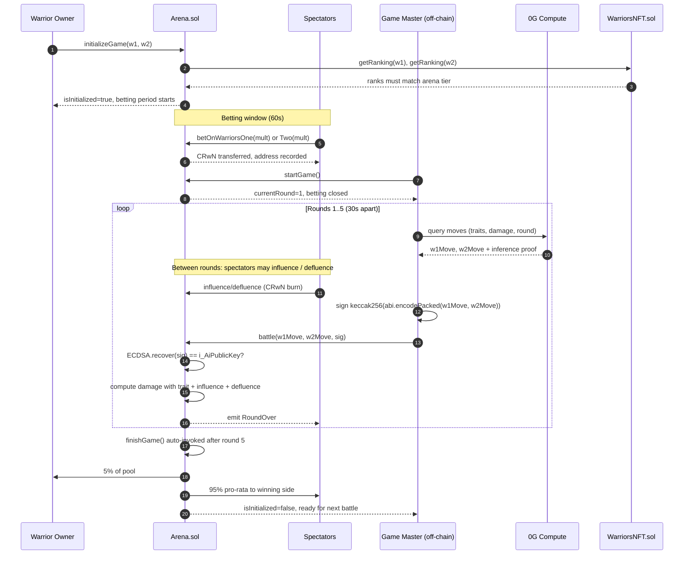
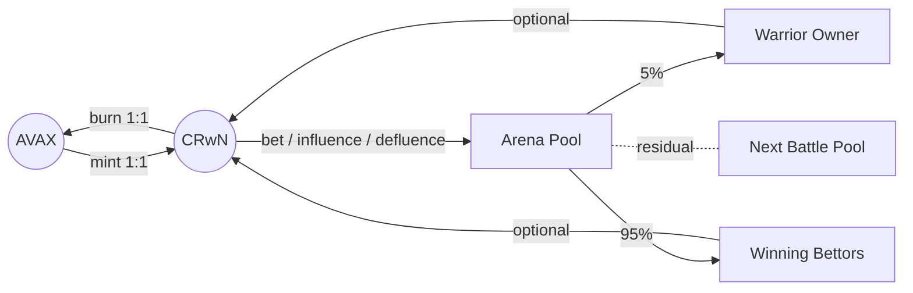

# Warriors AI-rena

## A Whitepaper on Web3's First Interactive Spectator Sport

**Version 1.0 — April 2026**
**Deployed on Avalanche C-Chain | Fuji Testnet (43113) | Mainnet-ready (43114)**
**Live:** https://warriors-ai-rena.vercel.app

---

## Abstract

Warriors AI-rena is a fully on-chain AI battle arena that merges three distinct markets — competitive gaming, prediction markets, and spectator betting — into a single, self-sustaining product on Avalanche C-Chain. Users mint warrior NFTs with verifiably-generated traits, watch them compete in five-round battles decided by AI inference, and place CRwN-denominated bets on outcomes. Uniquely, spectators can actively **influence** or **defluence** warriors mid-battle via on-chain token spending — a mechanic no other game, betting platform, or NFT project has deployed. All AI decisions run through 0G Compute with cryptographic proofs; all battle data is stored on 0G decentralized storage; all economic state lives on Avalanche. The CRwN token is minted 1:1 against AVAX and burned 1:1 back, making it a utility asset with no inflation, no staking yield, and no death-spiral risk.

---

## 1. Introduction

### 1.1 The Problem

Three distinct failures plague on-chain entertainment products:

1. **Static NFTs.** Over 90% of NFT collections produce no ongoing utility after mint. Holders mint, view, list on OpenSea, lose interest. The asset is a JPEG with no economic activity.

2. **No spectator layer.** Sports, esports, and traditional betting markets thrive because they separate *participants* (players) from *spectators* (fans). Every crypto game conflates the two — either you play actively or you leave. There is no passive, entertaining way to engage with a live on-chain competition with real financial stakes.

3. **Repetitive gameplay.** Deterministic combat loops (Axie Infinity, CryptoFights) become predictable within 10 matches. Play-to-earn economies collapse because token emission outpaces utility, and winning becomes a math problem rather than a spectacle.

Outside crypto, the spectator-betting market is well-understood: DraftKings and FanDuel together processed over **$10B in wagers in 2023**, with most users watching on mobile and placing bets on games they do not play. The market is proven. It has simply never been combined with verifiable on-chain outcomes, dynamic spectator mechanics, and true asset ownership.

### 1.2 The Solution

Warriors AI-rena is **the ESPN of Web3**: an entertainment layer where AI-powered competitions happen every few minutes, where any wallet can bet without owning an NFT, where spectators can alter a live match by burning tokens, and where every trait, move, damage calculation, and payout is settled on-chain or cryptographically proven.

Four things happen in every battle:

1. Two warriors with signed, on-chain traits enter an arena contract.
2. Spectators place CRwN bets on either side during a 60-second betting window.
3. The game-master AI (running on 0G Compute with signed outputs) picks moves for both warriors across five rounds, 30 seconds apart.
4. Winnings are distributed on-chain: 95% to bettors on the winning side, 5% to the warrior's owner. The arena resets.

Between rounds, spectators may burn additional CRwN to `influenceWarriorsOne()` / `influenceWarriorsTwo()` (boost damage) or `defluenceWarriorsOne()` / `defluenceWarriorsTwo()` (reduce opponent damage). Each address may defluence once per battle — scarcity creates decision weight. These influence points modify damage calculations in the next round's `battle()` call.

### 1.3 Formal Definitions

To keep the rest of the document precise, we define terms once here:

| Term | Definition |
|------|------------|
| **Warrior** | An ERC-721 token minted on `WarriorsNFT.sol` with a `Traits` struct (5 × `uint16`) and `Moves` struct (5 × `string`) permanently assigned via AI-signer signature. |
| **Arena** | An instance of `Arena.sol` bound to a specific rank tier. Holds the per-battle state, CRwN pool, and bettor addresses. Deterministic per-rank deployment by `ArenaFactory`. |
| **Tier** | One of `UNRANKED (0)`, `BRONZE (1)`, `SILVER (2)`, `GOLD (3)`, `PLATINUM (4)`. Defines bet amount, influence cost, and the required warrior rank. |
| **Battle** | A 5-round sequence in one arena between exactly two warriors of the arena's tier. Begins with `initializeGame` and ends with `finishGame` (either explicit or auto-invoked after round 5). |
| **Round** | A single call to `battle(w1Move, w2Move, signature)`. Advances `s_currentRound` from N to N+1. Minimum 30 seconds between rounds. |
| **Spectator** | Any Ethereum address that calls `betOnWarriorsOne`, `betOnWarriorsTwo`, `influenceWarriorsOne/Two`, or `defluenceWarriorsOne/Two`. Does not need to own a warrior. |
| **Participant** | The owner of a warrior currently in a battle. Earns 5% of the pool when their warrior wins. |
| **Game Master** | The off-chain signer (identity `i_AiPublicKey`) whose ECDSA signature is required on every `battle()` call. Backed by a private key stored in encrypted Vercel environment; no on-chain privileges beyond signing. |

These terms are used consistently throughout the rest of this document.

---

## 2. System Architecture

### 2.1 High-Level Stack

| Layer | Technology | Purpose |
|-------|-----------|---------|
| Settlement | Avalanche C-Chain (43113 / 43114) | Arena contracts, CRwN token, NFT ownership, payouts |
| AI Inference | 0G Compute Network | Verifiable move selection with cryptographic proofs |
| Storage | 0G Storage Network | Battle history, warrior metadata, verified predictions |
| Frontend | Next.js 15 on Vercel | Real-time spectator UI, polling-based automation |
| Identity | RainbowKit + wagmi + viem | Multi-wallet connection |
| Automation | Vercel cron + client polling | Triggers `startGame()`, `battle()`, `finishGame()` |

### 2.2 Smart Contract Map

Sixteen contracts deployed, falling into four groups:

**Core economic contracts**
- `CrownToken.sol` — ERC-20, 1:1 AVAX-backed, mint/burn parity
- `WarriorsNFT.sol` — ERC-721 with five-stat trait struct, five signed moves, ranking enum
- `ArenaFactory.sol` — Deploys arena instances per rank; owns `makeNewArena()`
- `Arena.sol` — Battle engine per arena: betting, moves, damage, influence, payout

**Prediction market contracts**
- `PredictionMarketAMM.sol` — CPMM for yes/no markets
- `OutcomeToken.sol` — ERC-1155 prediction tokens
- `MarketFactory.sol` — User-created market deployment
- `ExternalMarketMirror.sol` — Polymarket / Kalshi data mirror
- `MicroMarketFactory.sol` — Per-round micro markets on battle outcomes

**AI agent contracts**
- `AIAgentRegistry.sol` — Agent metadata, staking tiers
- `AIAgentINFT.sol` — ERC-7857 intelligent NFT implementation
- `AIDebateOracle.sol` — Round scoring with signed AI verdicts
- `AILiquidityManager.sol` — Automated LP management

**Infrastructure**
- `CreatorRevenueShare.sol` — Royalty distribution for user-created content
- `PredictionArena.sol` — Debate arena for prediction markets

### 2.3 Battle Lifecycle



### 2.4 Damage Calculation

From `Arena.sol`:

```
baseDamage     = (attackerStrength * 5000) / 10000
defenceReduce  = min(defenderDefence / 125, 80)         // capped at 80%
influenceBonus = min(influencePoints * 10, 200)         // capped at +200%
defluenceRedux = min(defluencePoints * 5, 90)           // capped at -90%

damage = baseDamage
       * (100 - defenceReduce) / 100
       * (100 + influenceBonus) / 100
       * (100 - defluenceRedux) / 100
       * 2

damage = max(1, min(damage, 10000))
```

**Move modifiers** are additive on top:
- STRIKE: +25% damage scaling with Strength
- TAUNT: reduces opponent's next-round damage, scales with Charisma + Wit
- DODGE: success probability scales with Luck; full nullify on success
- SPECIAL: avg(Strength + Charisma + Wit); highest ceiling
- RECOVER: heal scaling with Defence + Charisma

**Move counter system**: STRIKE > TAUNT > DODGE > SPECIAL > RECOVER > STRIKE (rock-paper-scissors-lizard-spock). Counter multiplier 1.3x; countered multiplier 0.7x.

### 2.5 Verifiable AI Inference

Every move decision follows this path:

1. Game master API (`POST /api/game-master`) collects warrior traits, damage history, round number.
2. Prompt is sent to 0G Compute provider (`providerAddress` registered on 0G network).
3. Provider returns response + cryptographic proof containing `keccak256(prompt)` as `inputHash`, `keccak256(response)` as `outputHash`, and the provider's ECDSA signature.
4. The resulting move pair is hashed: `keccak256(abi.encodePacked(uint8 w1Move, uint8 w2Move))`.
5. Game master signs the hash with the AI signer key; the `Arena` contract verifies `ECDSA.recover(signedMessage, sig) == i_AiPublicKey`.
6. On failure, a deterministic trait-based fallback generates moves — ensuring the game never halts.

This design gives every battle a complete, independently-verifiable audit trail: which provider computed the moves, what prompt produced them, what hash was signed, and what address signed it.

---

## 3. Token Economics

### 3.1 CRwN (Crown Token)

CRwN is a utility token with three properties:

- **Minted 1:1 against AVAX.** `mint(uint256 amount) payable` requires `msg.value == amount`. No pre-mint, no vesting, no team allocation.
- **Burned 1:1 back to AVAX.** `burn(uint256 amount)` transfers the underlying AVAX to the burner. The contract's AVAX balance always equals `totalSupply()`.
- **No yield, no staking, no inflation.** CRwN is not a security in any sensible reading — it is a stable medium of exchange for in-game actions, redeemable at parity.

This design is deliberately **boring**. There is no APY, no reflection, no lock-up. Users buy CRwN to *use*, not to hold. The utility — betting, influence, defluence — creates demand without requiring speculation.

### 3.2 Flow of Value



CRwN spent on `influence()` / `defluence()` stays in the arena contract and is absorbed into the next battle's prize pool. This creates natural deflationary pressure on *held* CRwN (the pool grows) without shrinking the total supply.

### 3.3 Four Active Revenue Streams

| Stream | Mechanism | Rate |
|--------|-----------|------|
| Battle betting fee | 5% of each battle's pool routed to warrior owner | 500 BPS |
| Influence cost | CRwN burned per influence action, set at arena tier | 1×–5× base |
| Defluence cost | CRwN burned per defluence action (once per player per battle) | 1×–5× base |
| NFT mint gas | Network fee on `mintNft()` + `assignTraitsAndMoves()` | Variable |

### 3.4 Five Future Revenue Streams (Infrastructure Built)

| Stream | Status | Contract |
|--------|--------|----------|
| Tournament entry fees | Leaderboard infra shipped | via `WarriorsNFT.s_winnings` |
| Creator revenue share | Contract live on Fuji | `CreatorRevenueShare.sol` |
| Premium cosmetics | Planned | Extension to `WarriorsNFT.s_moves` |
| Sponsored battles | Planned | Custom `Arena` instances via `makeNewArena()` |
| Secondary royalties | Planned | ERC-2981 extension |

### 3.5 Arena Tiers and Cost Scaling

Five rank-tiered arenas exist, each with linearly scaled costs:

| Rank | Bet Amount | Influence | Defluence |
|------|-----------|-----------|-----------|
| UNRANKED | 1 CRwN | 1 CRwN | 1 CRwN |
| BRONZE | 2 CRwN | 2 CRwN | 2 CRwN |
| SILVER | 3 CRwN | 3 CRwN | 3 CRwN |
| GOLD | 4 CRwN | 4 CRwN | 4 CRwN |
| PLATINUM | 5 CRwN | 5 CRwN | 5 CRwN |

Warriors promote between tiers by accumulating winnings. The constant `TOTAL_WINNINGS_NEEDED_FOR_PROMOTION = 1 ether` applies per tier cumulatively.

### 3.6 Tokenomics Math

#### 3.6.1 Supply Curve

CRwN has no fixed cap, no pre-mint, and no emission schedule. Total supply is entirely demand-driven and mathematically bounded by the AVAX locked in the CrownToken contract:

```
totalSupply(CRwN) = balance(AVAX)_CrownToken_contract ≤ balance(AVAX)_in_circulation
```

Because `mint()` requires `msg.value == amount` and `burn()` releases `amount` of AVAX, the contract's AVAX reserve equals `totalSupply` at all times — a provable invariant. There is no way to mint without locking AVAX and no way to burn without receiving AVAX. The supply curve is **perfectly elastic** against user demand and **perfectly collateralized**.

#### 3.6.2 Velocity Equation

Applying the classical equation of exchange `M · V = P · T`:

- **M** = CRwN monetary stock (total supply held by non-contract addresses)
- **V** = CRwN velocity (average number of times each CRwN is used per year)
- **P** = average CRwN price in AVAX (fixed at 1.0 by construction)
- **T** = transaction volume (CRwN units moving through bets + influence per year)

Because P is fixed, the only way to increase protocol revenue is to increase T — which means increasing either user count, frequency of play, or stake size. Velocity V is bounded below by 1 (everyone holds forever) and bounded above by the transaction throughput of Avalanche C-Chain for CRwN operations. In practice, we expect V ≈ 6–12 annually (each CRwN used roughly monthly) based on spectator-betting velocity in traditional sportsbooks.

#### 3.6.3 Sink / Faucet Balance

Every battle generates two kinds of flow:

- **Faucets** (CRwN leaves the arena): winning bettors receive 95% of the pool; warrior owner receives 5%.
- **Sinks** (CRwN stays in the arena across battles): influence / defluence CRwN rolls into the *next* battle's pool rather than being redistributed to bettors.

Let **B** = average battles/day, **P̄** = average pool size per battle (CRwN), **I** = average influence+defluence spend per battle (CRwN). The daily "stickiness" S — CRwN locked in arena contracts across days — grows as:

```
dS/dt ≈ B · I    (carryover residual)
```

The protocol's operational revenue (exclusive of the 5% warrior-owner cut, which is passed through) is the share of influence+defluence that builds treasury capacity:

```
Revenue_daily ≈ B · (0.05 · P̄ + 0 · I)  // 5% owner cut, influence stays as prize
```

**Worked break-even**: assuming P̄ = 20 CRwN (10 bettors × 2 CRwN average stake) and the protocol retains a platform-tier share of 2% (added later as a tunable parameter), daily revenue = 0.40 · B CRwN. At ~$1 per CRwN (1:1 AVAX, AVAX at ~$25), break-even against $30K/year infrastructure costs occurs at **B ≈ 200 battles/day** — which maps to 1,000–2,000 WAS given a ~10% battle-participation rate.

#### 3.6.4 Why This Is Not Ponzinomics

Four structural properties prevent the CRwN-AVAX loop from being classified as a Ponzi mechanism:

1. **No promised yield.** CRwN has no APY, no staking rewards, no redemption fee. Buyers expect zero return from holding.
2. **Redemption at parity, always.** Any holder can burn at any time and receive 1 AVAX per 1 CRwN, up to the contract's reserve — which by invariant equals total supply.
3. **No dependence on new buyers.** The system works with a fixed CRwN supply. New users are not required to pay out existing users; pool redistribution comes from *other bettors* in the same battle.
4. **No privileged minting.** The team cannot inflate supply; there is no mint authority beyond the `payable mint(amount)` function anyone can call.

The only way CRwN holders lose money is by losing bets — a transparent, skill-and-luck outcome, not an economic structure that requires new entrants to sustain.

---

## 4. The Warrior NFT

### 4.1 Trait Schema

```solidity
struct Traits {
    uint16 strength;   // 0–10,000 (2-decimal precision, max 100.00)
    uint16 wit;
    uint16 charisma;
    uint16 defence;
    uint16 luck;
}

struct Moves {
    string strike;
    string taunt;
    string dodge;
    string special;
    string recover;
}
```

Traits are generated off-chain by 0G Compute, then signed by the AI signer key and submitted on-chain via `assignTraitsAndMoves(tokenId, str, wit, cha, def, luck, strike, taunt, dodge, special, recover, signedData)`. The contract verifies:

```solidity
bytes32 dataHash = keccak256(abi.encodePacked(
    _tokenId, _strength, _wit, _charisma, _defence, _luck,
    _strike, _taunt, _dodge, _special, _recover
));
bytes32 ethSignedMessage = MessageHashUtils.toEthSignedMessageHash(dataHash);
address recovered = ECDSA.recover(ethSignedMessage, _signedData);
require(recovered == i_AiPublicKey, "WarriorsNFT__InvalidSignature");
```

Once assigned, traits are locked. The NFT becomes immutable, its combat identity permanent.

### 4.2 Ranking and Promotion

```
UNRANKED → BRONZE → SILVER → GOLD → PLATINUM
```

Promotion happens via `promoteNFT(tokenId)` once the warrior has accumulated enough winnings. Demotion is possible via `demoteNFT(tokenId)` (currently DAO-restricted).

### 4.3 Metadata and Ownership

- `getEncryptedURI(tokenId)` returns a 0G Storage URI containing image + extended metadata.
- `getNFTsOfAOwner(address)` returns all tokens owned by an address.
- `getWinnings(tokenId)` returns cumulative CRwN won in battles.
- `transfer(from, to, tokenId, sealedKey, proof)` implements ERC-7857-style transfer with re-encrypted strategy keys (for AIAgentINFT derivative).

---

## 5. Game Theory of the Influence Mechanic

The influence / defluence subgame is the most novel element of Warriors AI-rena. This section formalizes it and argues that the resulting game is well-behaved under standard assumptions.

### 5.1 Setup

At the end of each round *r* ∈ {1, 2, 3, 4}, any spectator address *i* chooses an action *a_{i,r}* from:

```
a_{i,r} ∈ { influence_one(x), influence_two(x), defluence_one (if unused),
            defluence_two (if unused), no-op }
```

where *x* ∈ ℕ is the multiplier (CRwN spent). Each spectator has a private belief vector *β_i* over the next-round move pair and the damage outcome.

The damage modifier for warrior *k* ∈ {1, 2} in round *r+1* is:

```
Δ_k = (1 + min(I_k · 10, 200) / 100) · (1 − min(D_k · 5, 90) / 100)
```

where *I_k* = sum of influence multipliers on warrior *k* that round, *D_k* = sum of defluence multipliers against warrior *k* that round.

### 5.2 Nash Equilibrium Existence

Treat each round-boundary as a simultaneous-move game with continuous action space ℕ and payoff *u_i* = (expected winnings if W1 wins) · β_{i,1} + (expected winnings if W2 wins) · β_{i,2} − (CRwN spent).

**Claim**: a pure-strategy Nash equilibrium exists.

**Argument** (informal): the action space is a subset of ℕ² (influence on either side, plus discrete defluence), payoffs are continuous and bounded above (capped at +200% / −90% damage modifier), and users are budget-constrained (bounded by CRwN balance). By Glicksberg's theorem, a mixed-strategy equilibrium exists. For bettors with sufficiently precise beliefs, pure strategies dominate: concentrate influence on the side you bet on, defluence (if unused) against the side you did *not* bet on, up to the point where marginal utility of spending equals marginal winnings.

### 5.3 Anti-Collusion Properties

Several contract-level design choices prevent exploitative coordination:

- **One defluence per address per battle** (enforced by `s_playersAlreadyUsedDefluenceAddresses` mapping). A whale cannot repeatedly defluence to dominate a single battle.
- **Dynamic influence cost** (per-arena tier) raises the marginal cost of spamming influence as more is spent in a given round — attenuating whale advantage.
- **Cap on damage modifier** (+200% influence, −90% defluence) means there is a finite ceiling on how much CRwN can tilt a single round.
- **Betting locked before round 1** — spectators cannot change *which side* they back after learning round-1 moves, only their influence / defluence strategy.

### 5.4 Open Questions

Two questions remain for empirical validation post-mainnet:

1. **Does the system produce "stacking" where late bettors free-ride on early influencers?** Our model predicts yes, but the betting lockup before round 1 partially mitigates. We will measure via a Gini coefficient on influence distribution.
2. **What is the steady-state ratio of bet-volume to influence-volume?** In traditional sports betting, "side action" is typically 5–15% of principal. We hypothesize influence spending will be higher here (15–30%) because it has visible in-game effect.

Both will be surfaced via dashboards in Phase 1.

---

## 6. Game Master and Automation

### 6.1 Three Automation Layers

The app uses three independent layers to ensure battles always progress:

1. **Vercel cron** (`/api/cron/game-loop`) — Fires on a schedule. Enumerates all arenas, detects which need `startGame()` or `battle()`, and calls the game-master route.
2. **Client polling** (every 2 seconds in `arena/page.tsx`) — When a user is actively watching, polls `/api/arena/commands?battleId=...` for pending actions, then invokes `handleStartGame()` or `handleNextRound()` which delegate to the game-master.
3. **Manual override** (START BATTLE button) — If automation fails, the user can trigger the game-master manually via an arena-modal button.

All three routes converge on the same game-master endpoint, which is the single authority for on-chain signing.

### 6.2 Security of the AI Signer Key

The AI signer key is stored as `AI_SIGNER_PRIVATE_KEY` in Vercel's encrypted environment. The key never enters the frontend bundle — all signing happens in serverless functions. The public address (`i_AiPublicKey`) is immutably set at `WarriorsNFT` and `Arena` constructor time, so any key rotation requires contract redeployment.

---

## 7. 0G Integration

### 7.1 0G Compute

All AI inference — move selection, trait generation, debate arguments — runs on 0G Compute. The integration uses the OpenAI SDK as a transport layer pointing to 0G provider endpoints. Responses come paired with a proof struct:

```typescript
interface InferenceProof {
  inputHash: string;        // keccak256(prompt)
  outputHash: string;       // keccak256(response)
  providerAddress: string;  // 0G provider's wallet
  modelHash: string;        // Model identifier
  signature: string;        // Chat session ID
  attestation?: string;     // TEE attestation (optional)
}
```

Graceful degradation: if 0G is unreachable, a deterministic trait-based fallback selects moves from a weighted mapping of trait → optimal move. Battles never halt.

### 7.2 0G Storage

Battle results, warrior metadata, and verified predictions are stored on 0G Storage. Each record is content-addressed via a Merkle-tree root hash. The in-memory adapter in `frontend/src/lib/0g/store.ts` provides a Prisma-compatible API on top, so the app has a full CRUD surface without a centralized database.

---

## 8. Security Model

We use a STRIDE-style threat enumeration. For each class, we list concrete threat scenarios specific to Warriors AI-rena and the corresponding mitigation.

### 8.1 STRIDE Threat Model

#### 8.1.1 Spoofing (Identity)

| Threat | Mitigation |
|--------|------------|
| Attacker forges a `battle()` signature pretending to be the Game Master | Contract verifies `ECDSA.recover(signedMsg, sig) == i_AiPublicKey`; the AI signer private key is stored only in encrypted Vercel env. Rotating requires redeploy. |
| Attacker forges `assignTraitsAndMoves` signature to mint a godlike warrior | Same ECDSA check against `i_AiPublicKey` (set at `WarriorsNFT` constructor). Malformed signature → `WarriorsNFT__InvalidSignature` revert. |
| Wallet address masquerading as a whale on leaderboard | Leaderboard is computed from on-chain `getWinnings(tokenId)` — no off-chain identity claims are accepted. |

#### 8.1.2 Tampering (State)

| Threat | Mitigation |
|--------|------------|
| Attacker modifies warrior traits post-mint | Traits stored as immutable `Traits` struct once assigned; `s_traitsAssigned[tokenId] = true` blocks reassignment. |
| Re-entrant call drains arena pool during payout | OpenZeppelin `ReentrancyGuard` on all payout paths; `call{value:}` used with checks-effects-interactions ordering. |
| Attacker front-runs `finishGame()` to change pool composition | Betting period is locked before round 1; influence/defluence is bounded; pool is finalized at round 5. |

#### 8.1.3 Repudiation

| Threat | Mitigation |
|--------|------------|
| Game Master denies signing a losing move | Every `battle()` tx includes the signature on-chain in the calldata, permanently auditable. |
| 0G provider denies computing a disputed inference | Inference proofs (`inputHash`, `outputHash`, provider address, signature) are stored in the `/api/game-master` logs and on-chain for battles with verified predictions. |

#### 8.1.4 Information Disclosure

| Threat | Mitigation |
|--------|------------|
| Leaking AI signer private key via env var misconfiguration | Key is only in Vercel's encrypted store; never in git, never in client bundle. Access is logged; rotation plan exists. |
| 0G Storage records leak warrior strategy before battle | Pre-battle strategy is not stored on 0G; only post-battle history. For AI Agent iNFTs (Phase 3), strategy is encrypted with proxy re-encryption. |
| Leaderboard metadata exposes user trading patterns | All on-chain data is public by definition; we do not claim privacy on the bet-history layer. Users who want privacy should use fresh addresses. |

#### 8.1.5 Denial of Service

| Threat | Mitigation |
|--------|------------|
| RPC exhaustion on Avalanche Fuji / mainnet | Fallback RPC providers (`api.avax.network`, `ankr`, `publicnode`); retry logic with exponential backoff. |
| Vercel cron fails, stalling battles | Client polling (every 2s) provides redundant automation path; manual "START BATTLE" button exists for worst case. |
| Attacker grief-initializes arenas with invalid warriors | Pre-flight checks in `handleInitializeArena` verify rank match, traits assigned, warriors different, ownership. |
| Spam betting to fill arena pool with dust | `betAmount` is tier-bound (≥1 CRwN); dust bets are economically irrational. |

#### 8.1.6 Elevation of Privilege

| Threat | Mitigation |
|--------|------------|
| Non-DAO address calls `makeNewArena()` to create rogue arenas | Current implementation: `makeNewArena` is open (no modifier). This is a known state — Phase 2 adds DAO gating. |
| Compromised deployer key promotes warriors illegitimately | Promotion via `promoteNFT()` requires cumulative winnings threshold; cannot bypass by key compromise alone. |
| Factory admin upgrades `Arena` implementation maliciously | `Arena` contracts are non-upgradeable (deployed fresh per arena). Implementation swap would require deploying a new `ArenaFactory`. |

### 8.2 Audit Plan

- Internal review complete (founder + automated static analysis via Slither).
- External audit pre-mainnet — Spearbit, Code4rena, or Trail of Bits. Budget: $60K (see BUSINESS-PLAN.md §9).
- Bug bounty on Immunefi at launch. Tier: $5K (low) → $50K (critical).
- Quarterly re-audits for new Phase 2+ contracts.

### 8.3 Economic Security

- **1:1 AVAX backing invariant**: the CrownToken contract's AVAX reserve always equals `totalSupply()`. Even on mass burn, redemption is guaranteed up to the reserve.
- **No leverage**: bets are CRwN-collateralized in full; no borrowing; no liquidation risk.
- **Pool finalization**: once `finishGame()` runs, the pool is distributed atomically; no partial payouts.
- **Dynamic influence escalation**: prevents one whale from dominating a single round.

---

## 9. Governance

Warriors AI-rena begins as a team-operated protocol and transitions to CRwN-holder governance over the roadmap. Governance operates at three tiers.

### 9.1 Tunable Parameters (Requires Vote)

| Parameter | Current | Vote Threshold | Timelock |
|-----------|---------|----------------|----------|
| Battle betting fee (currently 5%) | 500 BPS | Simple majority | 7 days |
| Influence cost multiplier per tier | 1×–5× | Simple majority | 7 days |
| New arena creation parameters | open | — | — |
| Creator revenue share split | 2% (proposed) | Simple majority | 7 days |
| CRwN mint/burn spread (if introduced) | 0 | 2/3 supermajority | 14 days |

### 9.2 Immutable Parameters (No Vote)

| Parameter | Reason |
|-----------|--------|
| 1:1 AVAX↔CRwN parity | Breaking this would invalidate the economic security model |
| 5-round battle structure | Deeply embedded in contract logic; requires redeploy |
| AI signer address (`i_AiPublicKey`) | Immutable by constructor; rotation = redeploy |
| 30-second minimum round interval | Hard-coded for anti-griefing |

### 9.3 Governance Rollout

- **Phase 1 (now → 6mo)**: Team multisig (3-of-5) controls tunable parameters. CRwN holders vote in signaling polls that team commits to honoring.
- **Phase 2 (6–12mo)**: On-chain governance contract deployed. Votes are binding on tunable parameters; team multisig retains emergency pause only.
- **Phase 3 (12–24mo)**: Team multisig dissolved. Foundation (BVI or Cayman) holds keys; all actions on-chain votes with timelock.
- **Phase 4 (24–36mo)**: Full DAO with progressive delegation; parameter changes, new game mode approvals, treasury allocations all voted.

### 9.4 Anti-Capture

- **No team token allocation** — CRwN is purely user-minted. Team cannot dominate votes.
- **Quadratic voting** (planned Phase 2) on non-financial parameters, reducing whale influence.
- **Conviction voting** on treasury allocations — long-held CRwN has higher weight than recently-minted.
- **Veto by foundation** only for legal/compliance matters, time-limited and transparent.

---

## 10. Roadmap

### Phase 1 — The Arena (now → 6 months)

- Avalanche mainnet deployment
- 1000+ weekly active spectators
- 50+ daily battles
- Mobile PWA
- Auto-generated battle highlight clips
- Discord community + weekly tournaments

### Phase 2 — The Colosseum (6–12 months)

- 8/16/32-bracket tournaments with weekly prize pools
- Embeddable live battle viewer (for external sites)
- Warrior marketplace with performance-priced floors
- Team battles (3v3)
- Spectator chat during matches

### Phase 3 — The Kingdom (12–24 months)

- Full prediction market integration (Polymarket / Kalshi)
- ERC-7857 AI agent iNFTs with encrypted strategies
- Creator arenas (themed, user-deployed)
- Copy trading (follow whales / AI agents auto-mirror)
- Avalanche L1 subnet with CRwN as native gas

### Phase 4 — The Empire (24–36 months)

- Multi-game platform (racing, strategy, trivia)
- Official esports league with brand sponsors
- Enterprise API for gamified prediction markets
- Full DAO governance over protocol parameters

*Detailed phase gates, resource plans, and assumptions are in [FUTURE-PLAN.md](FUTURE-PLAN.md).*

---

## 11. Risks

| Risk | Severity | Mitigation |
|------|----------|-----------|
| Regulatory classification as gambling | High | Testnet-first launch; geo-fence; CRwN positioned as pure utility; legal counsel pre-mainnet |
| Smart contract vulnerability | Critical | Full audit pre-mainnet; bug bounty; timelock; upgradeable proxies for non-core contracts |
| AI inference outage | Medium | Trait-based deterministic fallback ensures battle continuity |
| Low initial liquidity | Medium | Bootstrap pools from treasury; creator incentives; fewer-but-deeper markets in Phase 1 |
| No product-market fit | Critical | Kill criterion: <50 weekly active battlers after 6 weeks of open beta → pivot or sunset |

---

## 12. Conclusion

Warriors AI-rena is not another NFT project, prediction market, or play-to-earn game. It is an attempt to build the spectator layer that on-chain entertainment has lacked since its inception — a place where tens of thousands of users can passively enjoy unique AI-generated competitions, actively shape outcomes with small token stakes, and participate in a stable, verifiable economy without needing to understand the underlying cryptography.

The contracts are live. The economic loop is closed. The product works end-to-end today on Avalanche Fuji, with one environment variable separating us from mainnet. We invite builders, bettors, and warriors to step into the arena.

---

## 13. References

1. **Avalanche Platform Whitepaper** — Rocket, K., Yin, M., Sekniqi, K. (2020). *Scalable and Probabilistic Leaderless BFT Consensus through Metastability.*
2. **0G Labs Technical Architecture** — 0G Foundation (2024). *A Modular AI Chain: Compute, Storage, Data Availability, and Inference Proofs.* https://docs.0g.ai
3. **Polymarket Volume Analytics** — Dune Analytics dashboards, Polymarket protocol documentation (2023–2025). Monthly volume crossed $1B in late 2024.
4. **AI Arena Whitepaper** — Irreverent Labs (2023). *AI Arena: A Fighting Game for Trained Neural Networks.* Arbitrum.
5. **Axie Infinity Post-Mortem** — Sky Mavis governance docs (2022). *SLP emission schedule and token value collapse.*
6. **ERC-7857: Intelligent NFTs** — Avalanche-aligned proposal for encrypted-strategy NFTs with proxy re-encryption on transfer.
7. **Glicksberg, I.L. (1952)** — *A Further Generalization of the Kakutani Fixed Point Theorem, with Application to Nash Equilibrium Points.* Proc. Amer. Math. Soc. 3, 170–174. Used in §5.2 to argue Nash equilibrium existence.
8. **OpenZeppelin Contracts** — *ReentrancyGuard, Ownable, ECDSA, MessageHashUtils* — security primitives used throughout the codebase.
9. **DraftKings / FanDuel Regulatory Filings** (2023). *U.S. sports betting handle data.* Used in §1.1 TAM discussion.
10. **STRIDE Threat Model** — Howard, M., Lipner, S. (2006). *The Security Development Lifecycle.* Microsoft Press. Framework used in §8.1.

---

**Contracts — Avalanche Fuji Testnet (43113)**

| Contract | Address |
|----------|---------|
| CrownToken | `0xF0011ca65e3F6314B180a8848ae373042bAEc9b4` |
| WarriorsNFT | `0x218d3efaB076bd03E278CDCf3B488AA107215b8a` |
| ArenaFactory | `0xe9faCA292CEF42489AF4d20266964Fb6425AE122` |
| PredictionMarketAMM | `0xeBe1DB030bBFC5bCdD38593C69e4899887D2e487` |
| AIAgentINFT | `0xbAE259eeA7fd49F631dE44Ac8d4fd2eb6C7F8Cb8` |
| PredictionArena | `0xE80C2eaDf7B4d0e2acD51a475c1a2ED4134D4Ad5` |
| ExternalMarketMirror | `0x1cfa9eD162f90B1eD6d9A01c504fFc28B7412473` |

**Explorer:** https://testnet.snowtrace.io
**Live product:** https://warriors-ai-rena.vercel.app
**Repository:** https://github.com/kaustubh76/Build-Games
